## 项目启动的逻辑

```text
Bootstrap() 调用
│
├── 1. 解析命令行参数（-p, -cd, -cf, -i, -r, -cp 等）
│
├── 2. 加载配置文件（configuration.yaml）或从 Consul 拉取配置
│
├── 3. 向 Registry（Consul）注册本服务
│
├── 4. 连接 EdgeX 核心服务
│        ├── core-metadata（设备、Profile、ProvisionWatcher）
│        └── core-data / Message Bus（事件上报）
│
├── 5. 初始化缓存（设备、Profile、ProvisionWatcher 等）
│
├── 6. 调用 driver.Initialize(sdk) ← 用户自定义初始化逻辑
│
├── 7. 启动 REST API HTTP Server（设备命令路由）
│
├── 8. 启动 AutoEvents（自动采集事件）
│
├── 9. 调用 driver.Start() ← 用户初始化后置逻辑（新版本）
│
└── 10. 阻塞等待关闭信号（SIGTERM/SIGINT），触发 driver.Stop()
```

-------------------------------------------------------------------------

## 介绍 ProtocolDriver 接口

```go
type ProtocolDriver interface {
Initialize(lc logger.LoggingClient, asyncCh chan<- *AsyncValues, deviceCh chan<- []DiscoveredDevice) error
Stop(force bool) error

HandleReadCommands(deviceName string, protocols map[string]models.ProtocolProperties, reqs []CommandRequest) ([]*CommandValue, error)
HandleWriteCommands(deviceName string, protocols map[string]models.ProtocolProperties, reqs []CommandRequest, params []*CommandValue) error

AddDevice(deviceName string, protocols map[string]models.ProtocolProperties, adminState models.AdminState) error
UpdateDevice(deviceName string, protocols map[string]models.ProtocolProperties, adminState models.AdminState) error
RemoveDevice(deviceName string, protocols map[string]models.ProtocolProperties) error
}
```
### Device `Initialize/Stop`
`Initialize` 和 `Stop` 是 Device Service 生命周期的首尾两端, 这两个回调是由 Service 自身的启动与停止事件 触发的。它们通过底层的 `go-mod-bootstrap` 框架进行调度。

#### 第一层：外部触发源（生命周期事件）
- 启动阶段 (Start)：当通过命令行或 Docker 启动 Device Service 进程时，服务会进行一系列初始化操作（加载配置、连接 Consul/Redis、同步 Core Metadata）。在基础依赖就绪后，但在服务正式对外开放 HTTP/MessageBus 端口之前，会触发 `Initialize`。
- 停止阶段 (Shutdown)：当进程接收到操作系统的中断信号（如 SIGINT (Ctrl+C) 或 SIGTERM (Docker stop)）时，触发优雅退出流程，此时会调用 `Stop`。

#### 第二层：Bootstrap 引导与退出机制
EdgeX 服务使用 `go-mod-bootstrap` 来管理生命周期。在 `device-sdk-go` 中，生命周期的挂载点通常在 `pkg/service/init.go` 或内部的 bootstrap handler 中：

- 初始化路由：Bootstrap 框架会按顺序执行一系列的 `BootstrapHandler`。在针对 Device Service 的特定 Handler 中，会从 DI (依赖注入) 容器中取出 ProtocolDriver 并调用其 `Initialize` 方法。
- 退出路由：Bootstrap 框架会在后台监听 OS 信号。监听到退出信号后，它会反向遍历注册的 `wg.Wait()` 和 `ctx.Done()`，调用 `driver.Stop()`。

#### 第三层：Application 层 — Initialize 接口

`Initialize` 标志着 SDK 已经准备好，现在把控制权交给用户编写的 Driver，让其进行底层协议的初始化。

```go
Initialize(lc logger.LoggingClient, asyncCh chan<- *AsyncValues, deviceCh chan<- []DiscoveredDevice) error
```
这是用户编写 Driver 时最重要的入口，这三个参数的作用如下：

1. `lc logger.LoggingClient`：
- 作用：SDK 传递给 Driver 的日志客户端。
- 实现建议：Driver 应该将这个 lc 保存到自己的结构体中，后续所有的日志输出（如 lc.Debugf(...)）都使用它，这样可以保证日志格式统一，并受 Consul 中的日志级别动态控制。

2. `asyncCh chan<- *AsyncValues` (异步读取通道)：
- 作用：用于处理设备主动上报的数据。例如：MQTT 订阅收到的消息、TCP Server 接收到的设备心跳、BLE 设备的 Notify 通知。
- 实现建议：如果你的协议是异步的，应该在 Initialize 中启动一个 Goroutine，长连接监听设备数据，收到数据后打包成 AsyncValues 并推送到这个 asyncCh 中。SDK 的核心引擎会在另一端消费这个通道，并将其发送到 Core Data。

3. `deviceCh chan<- []DiscoveredDevice` (设备发现通道)：
- 作用：用于自动发现 (Auto-Discovery) 机制。
- 实现建议：如果服务配置了 `Device.Discovery.Enabled = true`，你可以在此通道推送网络扫描发现的未知设备。SDK 收到后会自动在 Core Metadata 中注册这些设备。如果不使用自动发现，可以忽略此通道。

#### 关键注意点
1. 阻塞问题：`Initialize` 绝对不能阻塞。如果你需要在启动时建立一个可能耗时很长的网络连接或启动一个无限循环的监听服务（如 TCP Listen），必须使用 go 关键字开启一个新的 Goroutine 在后台运行。如果 `Initialize` 阻塞，整个 Device Service 的启动流程都会卡死。
2. 错误处理：如果 `Initialize` 返回了 `error`，`go-mod-bootstrap` 会认为初始化失败，直接触发 `os.Exit` 终止整个 Device Service 进程。因此，只有在发生不可恢复的致命错误（如缺少关键证书）时，才应返回错误；如果是暂时性的网络断开，建议在后台 Goroutine 中实现重试逻辑，而 `Initialize` 本身返回 `nil`。
3. 生命周期顺序：在服务启动时，SDK 会先建立本地的设备和 Profile 缓存，然后再调用 `Initialize`。因此，在 Initialize 运行的时刻，Driver 是可以通过 SDK 的 API 去查询已经存在的设备列表的（这对协议层恢复之前的连接状态很有用）。

--------------------------------------

### Device Service 读写命令处理机制

`HandleReadCommands` 和 `HandleWriteCommands` 是 Device Service 的数据面（**Data Plane**）核心。与管理设备生命周期的回调不同，这两个接口专门用于处理对设备传感器数据的同步采集（**GET**）和设备控制（**PUT**）。

####  第一层：外部触发源（两条主要路径）
读写命令的触发通常不是 Device Service 自发的，而是来自以下两个源头：

- **路径 A — 外部微服务/客户端发起（按需读写）**：
外部应用（如 App 服务、UI 仪表盘或其他客户端）通过调用 `core-command` 微服务的 REST API 发起 GET/PUT 请求。`core-command` 查找到对应的 Device Service 后，会将请求转发到 Device Service 的命令 API：

```text
GET /api/v2/device/name/{name}/{command}  → 触发 HandleReadCommands
PUT /api/v2/device/name/{name}/{command}  → 触发 HandleWriteCommands
```

- **路径 B — 内部定时任务发起（AutoEvents）**：
在设备配置（Device Profile）中定义的 `AutoEvents` 机制。Device Service 内部的调度器会根据预设的频率（如 `Interval: "10s"`），周期性地在内部触发针对特定资源的读取操作，这最终也会调用 `HandleReadCommands`。

#### 第二层：HTTP 路由与 SDK 核心处理层

在 `internal/controller/http/command.go` 中，SDK 监听了上述 HTTP 请求。当收到请求后，会进入 `internal/application/command.go`（Application 层）。

这一层负责繁重的预处理工作：
1. 资源校验：检查请求的 `deviceName` 和 `command` 是否存在于缓存的 Device Profile 中。
2. 协议参数组装：提取设备的连接信息（`protocols`），例如 IP 地址、端口等。
3. 属性映射：将 Profile 中定义的 `deviceResource`（设备资源）及其底层特定协议的 `attributes`（如 Modbus 的寄存器地址、MQTT 的 Topic）打包成 `CommandRequest` 数组。

预处理完成后，SDK 才会将这些结构化数据传递给底层协议接口。

#### 第三层：Application 层 — `HandleReadCommands` 接口

当收到读取设备数据的请求时，SDK 会调用此接口。

```go
HandleReadCommands(deviceName string, protocols map[string]models.ProtocolProperties, reqs []models.CommandRequest) ([]*models.CommandValue, error)
```
入参解析：
- `deviceName`：目标设备名称。
- `protocols`：设备的物理连接信息（如 IP、波特率），通常在建立长连接的协议中（在 Initialize 阶段）已处理，这里可用于短连接协议（如 HTTP REST 设备）。
- `reqs []models.CommandRequest`：这是一个数组。因为 EdgeX 允许将多个 deviceResource 组合成一个逻辑 `deviceCommand`。这个数组包含了具体要读哪些传感器、数据类型是什么、以及设备底层的属性（`req.Attributes`，由你自己在 Profile 中定义，比如 `{ "primaryTable": "HOLDING_REGISTERS", "startingAddress": "10" }`）。

返回值：
  必须返回与 `reqs` 长度相同的 `[]*models.CommandValue` 数组，封装读到的具体数值，并标明时间戳和数据类型。

代码示例 (Driver 实现逻辑)：

```go
func (d *MyDriver) HandleReadCommands(deviceName string, protocols map[string]models.ProtocolProperties, reqs []models.CommandRequest) ([]*models.CommandValue, error) {
    // Create an array to hold the responses
    responses := make([]*models.CommandValue, len(reqs))
    
    // Process each read request in the batch
    for i, req := range reqs {
        // 1. Get protocol specific attributes (e.g., register address)
        address := req.Attributes["address"].(string)
        
        // 2. Read data from the physical device
        rawData, err := d.readFromDevice(address)
        if err != nil {
             // Return error if hardware read fails
            return nil, err
        }
        
        // 3. Wrap the raw data into an EdgeX CommandValue based on expected value type
        cv, err := models.NewCommandValue(req.DeviceResourceName, req.Type, rawData)
        if err != nil {
            return nil, err
        }
        
        // 4. Store the result
        responses[i] = cv
    }
    
    return responses, nil
}
```

#### 关键注意点

- **同步与阻塞 (Synchronous)**：这两个接口是同步调用的。HTTP 请求会一直阻塞，等待这两个函数返回。如果你在这里进行了耗时很长的重试或休眠，会导致客户端请求超时（SDK 默认超时通常为 15-20 秒）。
- **多线程安全 (Concurrency)**：如果多个客户端同时对同一个设备发起读写，SDK 会并发地调用你的 `HandleReadCommands` 或 `HandleWriteCommands`。如果你的底层通信库（如某些串口库）不支持并发操作，你必须在 Driver 内部使用 sync.Mutex 进行加锁，防止数据串扰。
- **批量处理的要求 (Batching)**：EdgeX 强烈建议 Driver 尽可能合并请求。比如 `reqs` 里有 3 个连续的寄存器读取请求，优秀的 Driver 实现不是发起 3 次物理网络请求，而是将它们合并为 1 次批量读取请求，解析后再分别填入 `responses` 中，这能大幅提升性能。

### Device `Add/Update/Remove` 的 Callback 机制分析

在 v2.3.0 中，这三个 `driver` 回调是通过 `core-metadata` 向 Device Service 发起 HTTP Callback 来触发的，不是由 Device Service 主动轮询。



####  第一层：外部触发源（两条路径）

**路径 A — 运行时操作：** 外部（UI、API 客户端、其他服务）通过调用 `core-metadata` 的 REST API 增删改设备时，`core-metadata` 会查找该设备所属的 Device Service，然后向它发出 HTTP 回调：

```
POST   /api/v2/callback/device                → AddDevice
PUT    /api/v2/callback/device                → UpdateDevice
DELETE /api/v2/callback/device/name/{name}    → DeleteDevice
```

**路径 B — 启动时预置设备：** `BootstrapHandler` 调用 `provision.LoadDevices()`，对尚未存在于 metadata 的预定义设备调用 `dc.Add(ctx, addDevicesReq)`，把设备注册到 `core-metadata`，后者再通过 HTTP callback 回调 Device Service，最终走同一条路径。

#### 第二层：HTTP 路由注册

`pkg/service/init.go` 的 `BootstrapHandler()` 里调用了 `ds.controller.InitRestRoutes()`，这个函数在 `internal/controller/http/restrouter.go` 里，把 HTTP 方法 + 路径绑定到 `RestController` 的三个 handler：

```go
c.addReservedRoute(common.ApiDeviceCallbackRoute, c.AddDevice).Methods(http.MethodPost)
c.addReservedRoute(common.ApiDeviceCallbackRoute, c.UpdateDevice).Methods(http.MethodPut)
c.addReservedRoute(common.ApiDeviceCallbackNameRoute, c.DeleteDevice).Methods(http.MethodDelete)
```

####  第三层：HTTP Handler（internal/controller/http/callback.go）

这一层只负责 I/O：解码 JSON Body，把 DTO 传给 application 层，再把结果序列化为 HTTP 响应。无任何业务逻辑。

####  第四层：Application 层（internal/application/callback.go）——核心

这里才是真正的业务逻辑，以 `AddDevice` 为例（源码 42–70 行）：

```go
func AddDevice(addDeviceRequest requests.AddDeviceRequest, dic *di.Container) errors.EdgeX {
    device := dtos.ToDeviceModel(addDeviceRequest.Device)
    // ① 从 metadata 拉取并更新 profile 缓存
    edgexErr = updateAssociatedProfile(device.ProfileName, dic)
    // ② 写入本地设备缓存
    edgexErr = cache.Devices().Add(device)
    // ③ 从 DI 容器取出 driver，调用回调
    driver := container.ProtocolDriverFrom(dic.Get)
    err := driver.AddDevice(device.Name, device.Protocols, device.AdminState)
    // ④ 重启该设备的 AutoEvents
    container.ManagerFrom(dic.Get).RestartForDevice(device.Name)
}
```

`UpdateDevice` 和 `DeleteDevice` 的结构完全对称，只是第 ③ 步分别调用 `driver.UpdateDevice()` 和 `driver.RemoveDevice()`。

####  第五层：DI 容器 + ProtocolDriver 接口

`container.ProtocolDriverFrom(dic.Get)` 从依赖注入容器取出用户注册的 `ProtocolDriver` 实例，接口定义在 `pkg/models/protocoldriver.go`：

```go
type ProtocolDriver interface {
    AddDevice(deviceName string, protocols map[string]models.ProtocolProperties, adminState models.AdminState) error
    UpdateDevice(deviceName string, protocols map[string]models.ProtocolProperties, adminState models.AdminState) error
    RemoveDevice(deviceName string, protocols map[string]models.ProtocolProperties) error
    // ... Initialize, HandleReadCommands, HandleWriteCommands, Stop
}
```

用户（如 `device-mqtt-go`）实现这个接口，在 `AddDevice` 里订阅 MQTT topic、建立连接等；`RemoveDevice` 里断开连接、清理资源。

####  关键注意点

服务启动时 `cache.InitCache()` 会从 `core-metadata` 拉取该服务下所有已有设备并放入缓存，这个过程不会调用 `driver.AddDevice()`。只有真正新增/更新/删除设备的操作（通过上述 HTTP callback 链路）才会触发这三个回调。

--------------------------------------
